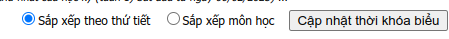

# SGU Extension

Because I don't see a timetable on the website, so I make it

## Installation

Install extension with chrome

- Save and extract the extension folder on your device.
- Go to chrome://extensions/.
- At the top right, turn on Developer mode.
- Click Load unpacked.
- Find and select the extension folder.

After modifying, click reload on chrome://extensions/ to make it effect

## How to use this extension

- Click button "Update Schedule" and login to SGU website
- After login, click button "Update Schedule" again to go to page "Schedule"
  
- Click "Cập nhật thời khóa biểu" to update schedule

## Features

- Show the timetable on the website
- View timetable without an internet connection
- Customize UI
- And more...

## Authors

- [@tnowad](https://www.github.com/tnowad)
